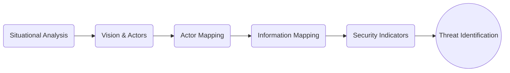
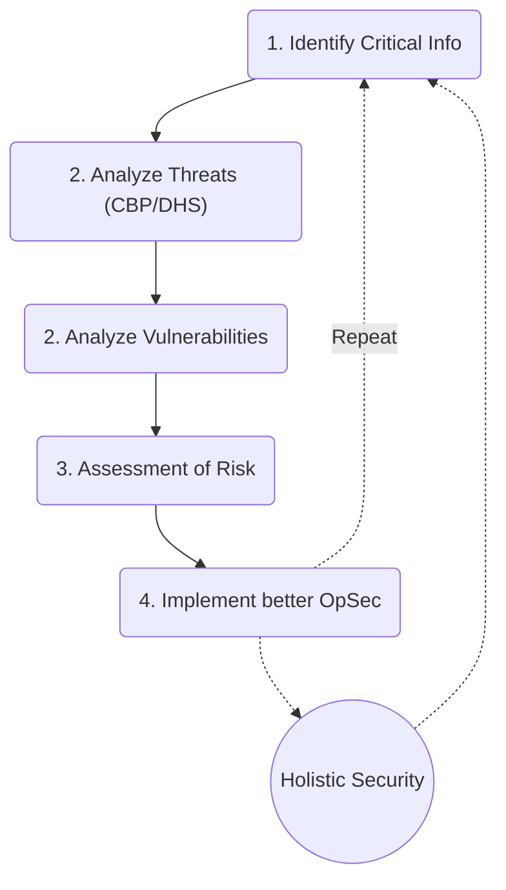

<!-- slide -->

<h1>Security at the Border</h1>  <b>Rory @\_falsemirror ;  Greyfox;  Sam @prolixpost  CryptoSquadNYC cypurr@protonmail.com </b> 

<!-- slide -->

# Goals of Presentation
* Intro to Threat Modeling & Holistic Security
* Understanding Customs and Border Patrol (CBP)
* Preventative Measures

<h6>**Emphasis = Risk Reduction**</h6>

### This is NOT
* A comprehensive know-your-rights lecture
* Legal advice
* An episode of Mr.Robot

<!-- slide data-background-image:"threatmatrix.png"-->

image from Holistic Security  by Tactical Tech Collective

<!-- slide vertical:true data-background-color:"#506f78" -->

#### Holistic Security

\* Tactical Tech Collective

<!-- slide data-background-color:"#506f78" vertical:true -->

#### Threat Modeling

\* Electronic Frontier Foundation

<!-- slide -->

## Personal Security Needs
* What makes you feel secure?
* What makes you feel vulnerable?
* How can you accommodate your needs when planning?
  * Which border? (Airport, train station, highway)
  * Time of day
  * Schedule
  * Cooperating with non-travelers

<!-- slide -->
## Identify Critical Info
* Documents? Contacts? Logs? IDs?
More substantial than "your data", makes concerns more tangible
* Impact? Think of info on 1–7 scale from   *"Public"* to *"Private at any cost"*
<!-- slide data-background-image:"threatmatrix.png" vertical:true -->

<!--  -->

<!-- slide -->
### Analyze the Threat:
#### Customs and Border Patrol (CBP) Overview
* ~~Fourth Amendment protections~~ little oversight, thus all searches are "reasonable"
* Shares resources/info with other state entities (e.g. DHS, NYPD)
* ***Felony*** to lie to CBP
* Jurisdiction within 100 miles of border (land and sea)

<!-- slide vertical:true data-background-image:"CBP-jurisdiction.png"
 -->

<!-- slide -->
## Analyze the Threat: CBP Searches
* Devices/Encryption seen as "opening a box"
  * Apps/internet are "inside" your phone
* Manual v. automated search/scans
* Can be sent for tech assistance, cracking, and/or translation
* CBP can keep data for "reasonable" time (~5 days)\*
* Can be shared with other agencies
* Access to legal records
* *Extended* searches/questioning for obstruction, being suspicious, or "random"

<!-- slide vertical:true -->
#### Analyze Vulnerabilities
* **YOU** are the biggest vulnerability with CBP.
  * CBP has leverage—if you can access they can access
  * Even if *you* can't access they may still punish you for not complying
#### Assessment of Risk
  * Risks of compromising data v. risk of protecting it.
  * What is already accessible to them?
  * Delay, embarrassment, [...] arrest, deportation

<!-- slide -->
#### Examples

<!-- slide vertical:true -->

<!-- slide vertical:true -->

<!-- slide vertical:true -->

<!-- slide -->
# What you can do
##### Tips for OpSec at the Border

<!-- slide -->
## At The Border: Rights for Citizens
> "US citizens can't be compelled to turn over passwords," Nathan Wessler, staff attorney at the ACLU "[...]It does have the right to seize electronic devices and send them off to a forensics lab for tests that could take weeks or months."

* Cannot be denied entry
* Not compelled to share social media yet (but don't lie)
* If warrant, will be immediately detained
* Must pay shipping, and there is no time limit

<!-- slide -->
## At The Border: Rights for Non-Citizens
* Permanent Residents
  * CBP may try to use detainment to force renouncement of documents
  * You have a right to a trial!
* Non-Resident (visa holder // undocumented )
  * CBP is not required to permit entry to US
  * Responsible for own return flight

<!-- slide -->
### At The Border: "Obstruction" & "Suspicion"
* Think context
  * Normal to have a wiped device?
  * Normal to have no device?
  * Normal to have extensive encryption?
* Looking for a clear narrative
  * Dazzle them with documentation
  * Remain calm
* "Obstruction" is vague
  * Not giving passwords
  * Not disclosing online accounts tied to identity
  * Destroying devices/data

<!-- slide -->

# While Traveling
* Countries visited may invite additional scrutiny
* Consider regulations based on point of departure
  * e.g. carry-on laptop ban
* Make plan that feels "safe"

\* ***Can't always control***

<!-- slide
-->

## Data and Device Prep
* Uninstall all the things!
* Password Management // Password Cleaning
* Do NOT have information on you that you cannot compromise (Critical info level ~3-7)
  * Use the Internet! (Store in cloud or send to peer)
  * Mail devices or memory cards
    * Booting from USB/SD
* Wipe devices—but fill with "normal" data!

<!-- slide
-->
### Data and Devices: Compartmentalize!
* Multiple online accounts
  * Beware ID "contamination"
* Multiple devices
#### Don't be too fancy
* "Fancy" = suspicious. Save for very particular circumstances (Deniable encryption;Tomb/keyfiles;SSSS)

<!-- slide -->
# Discussion
#### Work through example(s)

<!-- slide
-->
## Resources
* Holistic Security – Tactical Tech Collective
* An Introduction to Threat Modeling – SSD by EFF
* Online CyberSecurity Training
  * Tactical Tech Collective, Cutealism, resist.space, tcij.org, SSD by EFF
* In-Person CyberSecurity Training
  * CryptoSquad NYC, CryptoParty, ResistorNYC, Brooklyn Public Library
* Software Resources
  * Privacytools.io, prism-break.org, thatoneprivacysite.net
<!-- slide vertical:true-->
## Thanks to
* Electronic Frontier Foundation (EFF)
* American Civil Liberties Union (ACLU)
* Tactical Tech Collective
* The Register
* \@thegrugq

<!-- slide -->

# Break-out Workshops/Talks
* Secure Cloud (med-hard)
* Boot from USB/SD (med)
* Social Media && Passwords (easy)
